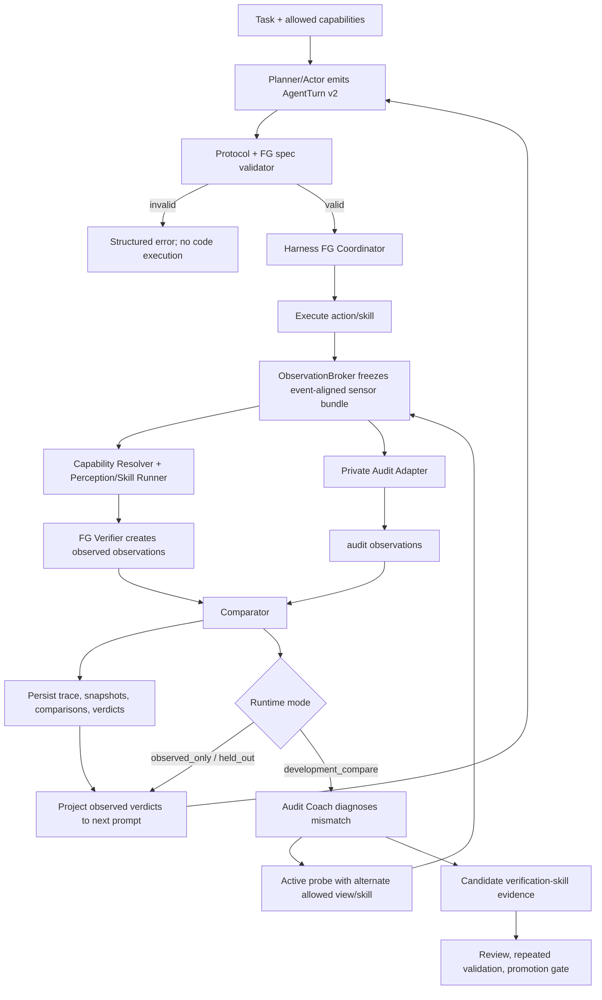

# ASPIRE Sim 动态 Factual-Grounding 重构设计

状态：Draft / 设计评审稿
日期：2026-09-11
范围：`aspire/sim`；不涉及 real-robot 运行，不改变现有实验协议或结果。

## 1. 摘要

本设计将现有“人工固定 predicate + 环境内 capture”的 Factual-grounding（FG）改造为“任务规划驱动的动态验证协议”。Agent 在任务开始时显式输出结构化 PLAN，并在 PLAN 中声明本任务需要验证的 FG 目标；harness 解析并验证这些目标，调度获准的视觉、几何、机器人状态或复合 Skill 产生 observed 证据，再由独立的 FG verifier 给出判断。仿真环境的 ground-truth/audit 通过独立私有通道生成相同语义字段的 audit 判断，用于差异测量、诊断和开发集上的验证方法改进。

核心原则如下：

1. FG 目标由 Agent 针对任务动态提出，而不是由人类为每个任务固定一组布尔字段。
2. 动态的是“目标实例、阈值、证据要求和验证策略”；predicate 类型、数据类型、安全规则和允许的感知能力仍由系统协议约束。
3. observed 与 audit 使用同一语义 schema，但保存在不同 channel；比较时对齐，决策时不混合覆盖。
4. generated code 不直接读写 FG，也不能访问 simulator ground truth。harness 是 observation、感知组件、FG 状态和 prompt 投影的唯一编排者。
5. 开发阶段可由隔离的 Audit Coach 使用 observed/audit 差异改进验证 Skill；正式 held-out 评测中 audit 只记录、不反馈、不学习。
6. FG 历史是 append-only。Agent 对目标的“增删改”表现为带版本和理由的 patch/event，而不是篡改既有快照。
7. `FINISH` 不是成功事实。任务成功、Agent 自认为完成、FG observed verdict 和 simulator audit outcome 必须分别保存。

## 2. 背景与现状问题

当前主流程在 [`cap/envs/tasks/base.py`](../aspire/sim/cap/envs/tasks/base.py) 的 `reset/step` 中直接创建 `FGTrialRuntime`，由 [`cap/integrations/franka/g17/adapter.py`](../aspire/sim/cap/integrations/franka/g17/adapter.py) 从环境 observation 映射少量固定字段。当前实现存在以下结构性限制：

- `target_held`、`wrong_object_held`、`target_near` 等任务事实是预定义字段，大多没有真实 observed producer。
- FG 目标不来自任务 PLAN，无法自然覆盖长任务、中间阶段、持续时间和任务特定关系。
- multi-turn 返回协议仅识别 `REGENERATE`，其他内容默认被当作 `FINISH`；参见 [`cap/utils/launch_utils.py`](../aspire/sim/cap/utils/launch_utils.py) 的 `_parse_multi_turn_decision`。
- LLM 的 plan、FG spec、验证请求、动作代码和结束判断没有统一结构化返回体。
- observed 与 audit 如果输出同名事实，当前 `FGSnapshot` 的名字唯一约束会发生冲突。
- audit、knowledge、trajectory evaluator、skill generator 目前主要是孤立接口，没有被 trial coordinator 编排成闭环。
- FG 结果只以简单 key/value 文本追加到下一轮 prompt，无法表达证据、置信度、UNKNOWN 原因、来源冲突和下一步验证建议。

因此本次重构不是扩充现有固定字段，而是调整 FG 的所有权和协议边界。

## 3. 术语与角色

### 3.1 角色

| 角色 | 职责 | 权限边界 |
|---|---|---|
| Planner/Actor Agent | 生成任务 PLAN、FG 目标和动作；根据 observed verdict 决定继续、探测、重规划或请求结束 | 只访问公开 prompt、公开 observation/Skill；不能访问 audit |
| Harness/Coordinator | 解析返回体、校验 FG spec、调度执行和感知、维护事件顺序、持久化、构造下一轮 prompt | 唯一编排者；不替 Agent 猜测自由文本含义 |
| Capability Resolver | 将声明式 FG 目标映射到已注册 verifier/Skill 和所需传感器 | 只能选择 allowlist 能力，不执行模型生成的任意验证代码 |
| Perception/Skill Runner | 调用相机、SAM、深度、点云、机器人状态及复合 Skill，产生证据 | 只使用 suite 允许的公开 API |
| FG Verifier | 将证据转换成 observed 判断，输出值、置信度、UNKNOWN 原因和证据引用 | 不能访问 simulator ground truth |
| Audit Adapter | 从 simulator 私有接口产生同 schema 的 audit 判断 | 私有 harness 域；不能进入 generated-code namespace |
| Comparator | 按 target/event/time 对齐 observed 与 audit，分类 mismatch | 不直接覆盖 observed 值 |
| Audit Coach | 在 development/calibration 模式下分析 mismatch，提出主动观测或 Skill 修正 | 与 Actor 隔离；held-out 禁用学习 |
| Skill Reviewer/Knowledge Gate | 将多次验证有效的修正方法沉淀为候选 Skill，再审查、冻结、晋升 | 不允许单次 mismatch 自动晋升；held-out 证据只报告 |

Planner、Verifier 和 Audit Coach 可以使用同一基础模型，但必须使用独立的结构化 prompt、会话状态和权限集合；不能因为“都是 Agent”而共享 audit 上下文。

### 3.2 三个容易混淆的对象

- **FG Target**：本任务需要判断什么，例如“方块与平台在持续窗口内无接触”。
- **FG Observation**：某个来源在某个事件上得到的值和证据，例如 `observed=false` 或 `audit=true`。
- **FG Verdict**：结合时效、证据充分性、跨视角一致性和规则后，harness 可用于 prompt/门控的结论。

不要把目标、一次测量和最终结论都称为一个“fact”。

## 4. 设计边界与关键决策

### 4.1 “来自 observation，但不是 Agent 调环境接口”的准确含义

仿真图像和机器人状态最终仍由环境提供。这里的目标边界应定义为：

```text
Environment sensor boundary
  → Harness ObservationBroker
  → Perception/Skill Runner
  → FG Verifier
```

而不是：

```text
LLM generated code → env.get_internal_state()/simulator ground truth
```

Harness 可以通过公开、可迁移到真实机器人的传感器接口获取 RGB、深度、标定、关节和夹爪状态；Agent 只声明“需要验证什么”和“希望采用哪种获准能力”，不直接持有环境对象或调用私有状态。

### 4.2 动态目标不等于任意动态代码

Agent 可以动态产生：

- subject/object 实例；
- predicate 类型；
- 期望值、阈值和容差；
- 必须观察的阶段或持续窗口；
- 所需视角、证据数量和优先级；
- UNKNOWN 时允许的主动观测策略。

Agent 不可以：

- 在 FG spec 中嵌入任意 Python；
- 引用 simulator 内部路径或 reward predicate；
- 自定义未经注册的危险 API；
- 在失败后删除关键成功锚点以使任务“完成”；
- 把 audit 值写回 observed channel。

系统仍需维护一个较小、可扩展的 predicate/operator registry，例如 `contact`、`inside`、`above`、`held_by`、`distance`、`stable_for`、`visible_from`。Registry 定义类型和验证契约，而不是为每个任务预先固定事实实例。

### 4.3 同字段、分 channel

observed 与 audit 必须使用同一 `FGObservation` schema 和相同 `target_id`，但放入不同 channel：

```text
observed[target_id, event_id] = FGObservation(..., source_channel="observed")
audit[target_id, event_id]    = FGObservation(..., source_channel="audit")
```

不能将两组同名事实先拼接进一个要求名字唯一的 snapshot。Snapshot 应改为：

```text
FGSnapshot
  spec_revision
  event_id
  observed: tuple[FGObservation, ...]
  audit: tuple[FGObservation, ...]        # 可不存在/不可见
  comparisons: tuple[FGComparison, ...]
  public_verdicts: tuple[FGVerdict, ...]
```

相同字段是为了可比较；`source_channel`、`method_id`、证据和时间信息仍必须存在，否则无法知道差异来自哪个方法。

### 4.4 Audit 不能默认进入 Actor 在线闭环

如果 Agent 在正式评测时看到环境真值并据此修正行为，这已经是 GT-assisted 方法，不再满足当前 ASPIRE “只用真实机器人可获得信息”的默认协议。

因此定义三种运行模式：

| 模式 | Actor 可见 | Audit Coach | Skill 更新 | 用途 |
|---|---|---|---|---|
| `observed_only` | observed verdict | 关闭 | 可使用既有冻结 Skill | 正常运行/真实机器人兼容 |
| `development_compare` | observed verdict；可见公开探测结果 | 可见 observed + audit + mismatch | 可提交候选，必须走验证门 | 开发集上学习验证方法 |
| `held_out_audit` | observed verdict | audit 仅离线记录 | 禁止 | 无泄漏正式评测 |

如确需把 audit mismatch 或真值反馈给执行 Agent，应新增明确命名的 `gt_assisted_online` 协议，并单独报告实验结果，不能与 observed-only 基线混合。

## 5. 结构化 Agent 返回协议

### 5.1 新的 `AgentTurn` Envelope

当前自由文本 `REGENERATE/FINISH` 协议应升级为版本化 JSON envelope。建议初始结构：

```json
{
  "protocol_version": "agent-turn-v2",
  "turn_kind": "plan_action",
  "plan": {
    "revision": 1,
    "stages": [
      {"id": "s1", "goal": "grasp cube with right arm"},
      {"id": "s2", "goal": "hold cube above platform without contact"}
    ]
  },
  "fg_patch": {
    "base_revision": 0,
    "operations": [
      {
        "op": "add",
        "target": {
          "id": "fg.no-contact-dwell",
          "stage_id": "s2",
          "subject": "cube",
          "predicate": "contact",
          "object": "platform",
          "operator": "equals",
          "expected": false,
          "criticality": "required",
          "temporal": {"kind": "continuous", "duration_steps": 20},
          "evidence_policy": {
            "min_independent_views": 2,
            "preferred_methods": ["main-camera-contact", "right-wrist-contact"]
          }
        }
      }
    ]
  },
  "action": {
    "kind": "python",
    "code": "..."
  },
  "verification_requests": ["fg.no-contact-dwell"],
  "decision": "execute"
}
```

后续合法的 `decision` 至少包括：

- `execute`：执行动作代码或调用 Skill；
- `observe`：不执行任务动作，只执行主动观测；
- `revise_plan`：提交新 PLAN/FG patch；
- `finish_request`：Agent 请求结束，由 harness 做完成门检查；
- `abort`：明确不可恢复。

### 5.2 FG 目标 patch 语义

支持 `add`、`replace`、`retire`，但采用 append-only revision：

- 每个 patch 必须声明 `base_revision`，防止陈旧写入。
- `replace/retire` 必须有 `reason_code` 和父 target ID。
- 第一项任务动作执行后，`required` 成功锚点不能由 Actor 单独降低为 optional 或删除。
- 新目标必须通过 schema、能力、权限、可观测性和资源预算校验。
- 不可支持的目标返回 `unsupported`，要求 Agent 重新规划；不能默认为 False。

### 5.3 Parser 与错误恢复

新增严格 parser，禁止“未发现 REGENERATE 就默认 FINISH”：

```text
raw model response
  → extract exactly one AgentTurn JSON
  → syntax validation
  → schema validation
  → semantic/safety validation
  → capability validation
  → accepted AgentTurn or structured ProtocolError
```

解析失败时不执行任何代码，并把机器可读错误返回下一轮。为兼容现有实验，可以保留 `legacy-code-v1` adapter，但新 FG 流程只接受 `agent-turn-v2`。

## 6. 核心数据契约

### 6.1 `FGTarget`

```python
@dataclass(frozen=True)
class FGTarget:
    id: str
    stage_id: str
    subject: EntityRef
    predicate: str
    object: EntityRef | None
    operator: str
    expected: JsonValue
    value_type: str
    criticality: Literal["required", "supporting", "diagnostic"]
    temporal: TemporalRequirement
    evidence_policy: EvidencePolicy
    unknown_policy: Literal["probe", "replan", "fail_closed", "report_only"]
    created_by_turn: int
```

### 6.2 `FGObservation`

```python
@dataclass(frozen=True)
class FGObservation:
    target_id: str
    spec_revision: int
    event_id: str
    phase: str
    source_channel: Literal["observed", "audit"]
    method_id: str
    value: JsonValue | None
    status: Literal["known", "unknown", "unsupported", "error"]
    confidence: float | None
    uncertainty: dict[str, JsonValue]
    evidence_refs: tuple[str, ...]
    sensor_refs: tuple[str, ...]
    observed_at_step: int
    valid_until_step: int | None
```

`None` 不能同时表示 false、空、未见和无法判断；必须结合明确的 `status` 和 `uncertainty.reason_code`。

### 6.3 `FGComparison`

```python
@dataclass(frozen=True)
class FGComparison:
    target_id: str
    event_id: str
    observed_ref: str
    audit_ref: str
    alignment: Literal["match", "mismatch", "indeterminate", "stale"]
    mismatch_class: str | None
    comparable: bool
    tolerance_used: JsonValue | None
```

比较前必须满足相同 `target_id`、`spec_revision`、`event_id` 和允许的时间偏差；否则标记 stale/indeterminate，不能把时序错位算成感知错误。

### 6.4 `FGVerdict`

`FGVerdict` 是 Actor 和控制门使用的公共结论：

```python
@dataclass(frozen=True)
class FGVerdict:
    target_id: str
    state: Literal["satisfied", "violated", "unknown", "conflicted", "expired"]
    confidence: float | None
    based_on: tuple[str, ...]
    next_probe_options: tuple[str, ...]
    observed_only: bool = True
```

默认控制决策只能消费 `observed_only=True` 的 verdict。Audit 值可以产生 comparison 和离线指标，但不能静默提升 observed verdict 的确定性。

## 7. 端到端流程



### 7.1 任务开始

1. Harness 构造 capability manifest，列出本 suite 可用传感器、perception components、Skill、预算和禁止 API。
2. Planner 接收任务、首帧公开 observation 摘要和 capability manifest。
3. Planner 输出显式 PLAN、初始 FG targets 和首个 action/observation request。
4. Parser/validator 拒绝无法观测、类型不一致、使用禁用接口或资源超预算的目标。
5. Harness 冻结 `FGSpec revision 1`，生成 content hash。

### 7.2 每个动作边界

1. 执行获准的代码或 Skill，产生唯一 `event_id`。
2. ObservationBroker 在动作前后或指定 phase 冻结传感器 bundle；所有视角带同一逻辑事件、相机时间戳和标定版本。
3. Capability Resolver 为待验证 targets 选择 verifier plan。
4. Perception/Skill Runner 执行主相机、腕部相机、分割、深度、几何或时序检查。
5. FG Verifier 为每个 target 生成 observed observation；证据不足必须返回 UNKNOWN。
6. 如运行模式允许，Audit Adapter 生成相同 target 的 audit observation。
7. Comparator 对齐并分类差异；Verdict Builder 仅从公开证据构造 Actor-visible verdict。
8. 全部对象先持久化，再生成下一轮 prompt，保证 prompt 内容可追溯到不可变引用。

### 7.3 主动验证和修正

出现 UNKNOWN、公开多视角冲突或 development mismatch 时：

1. Diagnostic Agent 生成有限候选假设，例如 `occlusion`、`bad_viewpoint`、`identity_swap`、`threshold_bias`、`temporal_misalignment`、`calibration_error`。
2. Probe Planner 从 capability registry 选择信息增益最高且风险可接受的动作，例如增加左腕视角，而不是直接猜测真值。
3. Harness 运行 probe，并以新 evidence ref 重新验证同一 target；原 observation 不覆盖。
4. 若修正方法在多个 development 事件上降低 mismatch，生成 `VerificationSkillCandidate`。
5. Skill 必须经过重放、负例、跨视角、跨场景及 leave-one-task/family-out 检查后才能晋升。
6. held-out mismatch 永不触发 Skill 更新。

## 8. 双臂“悬停且不接触平台”示例

任务：右臂举起方块，使其在平台上方停留且不接触平台。

### 8.1 Agent 生成的任务锚点

| target | 语义 | 证据要求 |
|---|---|---|
| `fg.right-holds-cube` | 方块由右夹爪稳定持有 | 右腕 + 主相机，跨帧相对运动一致 |
| `fg.cube-above-platform` | 方块位于平台上方且间隙大于容差 | 深度/点云或多视角几何 |
| `fg.no-cube-platform-contact` | 方块与平台无接触 | 至少两个独立视角；遮挡时 UNKNOWN |
| `fg.hover-stable-window` | 上述状态连续满足 N 步，速度低于阈值 | 时序聚合，不允许单帧完成 |
| `fg.left-arm-clear` | 左臂未干扰任务空间 | 机器人状态 + 公开视觉，可作为安全锚点 |

这里的目标集合由 Planner 根据“右臂、举起、平台上方、不接触、停留”等任务语义动态生成，而不是环境为所有任务固定五个布尔值。

### 8.2 差异诊断

假设同一 `event_id` 下：

```text
main camera observed contact = false
right wrist observed contact = false
audit contact = true
comparison = mismatch
```

Audit Coach 不应立刻把 observed 改为 true，而应形成假设：

- 主相机和右腕视角存在共同遮挡；
- 接触只发生在方块背面或边缘；
- 视觉判断的距离阈值偏小；
- 图像和 audit 的采样时刻没有对齐；
- 平台/方块实例绑定错误；
- simulator contact 为瞬时碰撞，而视觉帧落在接触之后。

随后选择主动 probe：让左臂保持不运动，仅使用左腕相机提供第三视角。若左腕视觉和深度几何连续发现零间隙，则产生新的 observed evidence，并记录修正路径：

```text
when:
  predicate = contact
  main/right-wrist agree on no-contact
  audit mismatch exists in development
  suspected occlusion = true
then:
  request left-wrist oblique view
  run segmentation + depth gap estimator
  require temporal confirmation
```

该方法可以成为 `multiview-contact-disambiguation` 候选 Skill，但只有跨多个 development 场景验证后才能晋升。不能把“audit=true”本身写进 Skill，也不能让 Skill 调用 simulator contact API。

## 9. Prompt 回传设计

下一轮 Actor prompt 应接收结构化、有限长度的 FG projection，而不是整个私有 snapshot：

```text
FG SPEC r3 / snapshot sha256:...
Stage: s2 hold-above-platform

Required anchors:
- fg.right-holds-cube: SATISFIED, confidence=0.91, evidence=[...]
- fg.cube-above-platform: SATISFIED, confidence=0.83, evidence=[...]
- fg.no-cube-platform-contact: UNKNOWN, reason=occluded-contact-region
- fg.hover-stable-window: UNKNOWN, progress=8/20 steps

Available public probes:
- left-wrist-oblique-contact-check
- move-main-camera-not-supported

Harness decision:
- FINISH currently not admissible because 2 required anchors are UNKNOWN.
```

Prompt 中不应出现：

- audit 真值；
- simulator contact/body pose/BDDL/reward predicate；
- 私有阈值或内部对象 ID；
- 未执行的恢复动作被描述成已完成；
- 与本轮 snapshot hash 不一致的旧事实。

如果是 `development_compare`，Audit Coach 使用单独 prompt；它的输出先转成 public probe/Skill proposal，再由安全校验后执行，不能把 audit 原文转发给 Actor。

## 10. 持久化与 trace

建议每个 trial 使用以下 append-only 工件：

```text
trial_dir/
  agent/
    turns.jsonl                  # 原始响应 hash + 解析后的 AgentTurn
    protocol_errors.jsonl
  plan/
    revisions.jsonl              # PLAN 和 FG patch revisions
  fg/
    targets.jsonl
    observations.observed.jsonl
    observations.audit.jsonl     # 私有；按协议限制访问
    comparisons.jsonl
    verdicts.jsonl
    snapshots.jsonl
    prompt_projections.jsonl
    active_probes.jsonl
  execution/
    events.jsonl
    code_blocks/
  evidence/
    manifest.json
    images/                      # 内容寻址或受控引用
    derived/
  skill_proposals/
    verification_candidates.jsonl
```

每一轮必须形成如下可追溯链：

```text
AgentTurn hash
  → FG spec revision hash
  → execution event ID
  → sensor/evidence hashes
  → observed/audit observation hashes
  → comparison/verdict hashes
  → prompt projection hash
  → next AgentTurn hash
```

大图像和视频不重复嵌入 JSON，使用内容寻址引用。Audit 工件与公开工件必须具有独立访问策略。

## 11. Skill 沉淀设计

需要沉淀的不是某个 trial 的真值答案，而是可迁移的验证方法。新增 `VerificationSkill`：

```python
@dataclass(frozen=True)
class VerificationSkill:
    id: str
    version: str
    supported_predicates: tuple[str, ...]
    required_capabilities: tuple[str, ...]
    preconditions: tuple[str, ...]
    observation_plan: tuple[ProbeStep, ...]
    verifier_id: str
    thresholds: dict[str, JsonValue]
    uncertainty_policy: dict[str, JsonValue]
    contraindications: tuple[str, ...]
    development_evidence_refs: tuple[str, ...]
    audit_metrics_ref: str
```

晋升至少要求：

- 来源为 development；
- 有不匹配前后的量化结果，而不只是 LLM 自评；
- 同时包含正例、负例、UNKNOWN/遮挡例；
- 不读取 forbidden API，不编码 simulator-specific ground truth；
- 对旧方法有配对比较；
- 在冻结 checkpoint 上复验；
- 通过现有 knowledge review/promotion gate，而不是直接写入 active library。

现有 [`cap/skills/library.py`](../aspire/sim/cap/skills/library.py) 基于函数出现次数自动晋升，不足以承载本设计。应复用 `cap/knowledge` 的 provenance、checkpoint、review 和 held-out 隔离机制。

## 12. 建议模块与改动入口

### 12.1 新增模块

```text
cap/agent_protocol/
  models.py             # AgentTurn、Plan、Action、FGPatch
  parser.py             # 严格 JSON 解析及版本协商
  validator.py          # schema、语义、安全和能力验证
  prompt.py             # planning/acting/protocol-error prompt

cap/factual_grounding/
  targets.py            # FGTarget、revision、patch 规则
  observations.py       # FGObservation、FGSnapshot
  registry.py           # predicate/operator/verifier registry
  verifier.py           # observed evidence → verdict
  comparator.py         # observed/audit 对齐和 mismatch 分类
  coordinator.py        # 每轮调度、预算、状态机
  prompt_projection.py  # 公开投影
  persistence.py        # append-only store 和 hash chain

cap/perception/
  observation_broker.py # event-aligned 多视角 sensor bundle
  capability_registry.py
  probe_runner.py

cap/knowledge/
  verification_skill.py
  verification_evidence.py

cap/integrations/<suite>/
  fg_audit_adapter.py    # suite-private audit producer
```

### 12.2 修改现有入口

| 现有文件 | 建议改动 |
|---|---|
| [`cap/envs/trial.py`](../aspire/sim/cap/envs/trial.py) | 主入口：用 `AgentTurnParser + FGCoordinator` 替换仅支持代码/REGENERATE/FINISH 的循环；在执行前验证 plan/action，在执行后调度 FG |
| [`cap/utils/launch_utils.py`](../aspire/sim/cap/utils/launch_utils.py) | 将 `_parse_multi_turn_decision` 降级为 legacy adapter；不再把任意非 REGENERATE 内容视为 finish |
| [`cap/envs/tasks/base.py`](../aspire/sim/cap/envs/tasks/base.py) | 环境只返回 action result 和 observation handle；不再在环境对象内部拥有完整 FG 编排 |
| [`cap/factual_grounding/models.py`](../aspire/sim/cap/factual_grounding/models.py) | 将固定单通道 fact snapshot 迁移为 target/observation/comparison/verdict 分层契约 |
| [`cap/factual_grounding/runtime.py`](../aspire/sim/cap/factual_grounding/runtime.py) | 收缩为 per-trial state/store，或由新 coordinator/persistence 替代 |
| [`cap/factual_grounding/projection.py`](../aspire/sim/cap/factual_grounding/projection.py) | 输出任务目标、状态、证据、UNKNOWN 原因和 probe options，而非平铺 key/value |
| [`cap/integrations/franka/g17/hooks.py`](../aspire/sim/cap/integrations/franka/g17/hooks.py) | 只发布动作边界事件和消费公开 verdict；不自行从 env 采事实 |
| `cap/integrations/vision/*` | 注册为 capability/verifier component，保留现有服务实现 |
| `cap/knowledge/*` | 接收 VerificationSkillEvidence，沿用 development/held-out、checkpoint、review、promotion 约束 |

`trial.py` 应成为第一实施入口，因为它同时拥有 LLM 请求、返回解析、代码执行、多轮 prompt、视觉反馈和工件保存的上下文。

## 13. Coordinator 状态机

建议把隐式循环改为显式状态：

```text
TASK_RECEIVED
  → PLAN_REQUIRED
  → PLAN_VALIDATED
  → READY_TO_EXECUTE
  → ACTION_RUNNING
  → OBSERVATION_FROZEN
  → FG_VERIFYING
  → VERDICT_READY
      ├→ READY_TO_EXECUTE
      ├→ PROBE_REQUIRED → FG_VERIFYING
      ├→ REPLAN_REQUIRED → PLAN_VALIDATED
      ├→ FINISH_GATE → COMPLETED
      └→ ABORTED
```

关键约束：

- 没有有效 PLAN/FG spec 不执行第一段动作代码。
- 每个 action 对应一个不可复用的 event ID。
- required target 的 UNKNOWN/CONFLICTED 是否允许继续，由 `unknown_policy` 决定；是否允许 finish 由 finish gate 统一决定。
- `finish_request` 只有在所有 required anchors 满足时才接受；否则返回结构化拒绝原因。
- 环境 reward/task_completed 只作为独立 evaluation outcome，不反向篡改 observed verdict。

## 14. 配置建议

```yaml
runtime_features:
  factual_grounding:
    protocol: dynamic-v2
    enabled: true
    runtime_mode: observed_only      # observed_only | development_compare | held_out_audit
    planner_required: true
    max_targets: 24
    max_fg_revisions: 6
    max_active_probes_per_turn: 3
    finish_requires_all_required: true
    prompt_projection: visible
    audit_projection: private
    persistence: append_only

  verification_skills:
    checkpoint_id: fg-verifier-v1
    allow_runtime_promotion: false
    development_proposals: true
```

配置必须位于 `env.cfg.runtime_features` 或由统一 config composer 明确合并。启动前验证：mode、suite audit adapter、可用 perception 服务、checkpoint 和输出访问策略是否一致。

## 15. 迁移计划

### M0：协议与 shadow trace

- 实现 `AgentTurn v2`、PLAN/FG target parser、validator 和持久化。
- 不改变当前动作执行与成功判断；仅记录 Agent 生成的目标。
- legacy 协议保持可选，配置显式区分。

验收：错误 envelope 不执行代码；每轮 plan/target/action 有 hash 和 provenance。

### M1：Harness observed pipeline

- 实现 ObservationBroker、capability registry 和少量基础 verifier。
- 支持 RGB/depth/robot state 的 event-aligned evidence。
- 新 FG 输出 shadow 保存，不进入 Actor prompt。

验收：同一 observation bundle 可确定性重放；UNKNOWN 原因可区分遮挡、缺能力和执行错误。

### M2：Actor-visible FG

- 增加公共 verdict builder、prompt projection 和 finish gate。
- 仅启用 observed-only verdict。

验收：prompt 可追溯到 snapshot；critical UNKNOWN 不被描述为成功；旧事实过期后不能继续门控。

### M3：Private audit comparison

- 为选定 simulator 实现独立 audit adapter。
- 实现相同 target schema、时间对齐和 mismatch 分类。
- `held_out_audit` 只记录，不反馈。

验收：同名目标可在双 channel 共存；audit 数据不会出现在生成代码 namespace、Actor prompt 或公开 trace。

### M4：Development Audit Coach 与主动观测

- 加入差异诊断、probe planner 和预算。
- 支持多视角 contact/holding/placement 验证示例。

验收：probe 是允许的可迁移感知动作；失败/无信息 probe 不会无限循环；原始证据不被覆盖。

### M5：Verification Skill 沉淀

- 建立候选 evidence、配对评估、review、checkpoint 和 promotion。
- 禁止 held-out 更新和单例自动晋升。

验收：Skill 不含 ground-truth 调用或真值常量；冻结 Skill 在新 development 场景上确实降低 mismatch/UNKNOWN。

### M6：受控实验

- 分别评估 baseline、dynamic observed FG、development-learned frozen FG；GT-assisted 如需要则单列。
- 预注册任务、种子、预算、模型、checkpoint 和指标。

验收：报告成功率之外，同时报告 FG coverage、precision/recall、UNKNOWN rate、mismatch rate、probe cost、false finish 和 Skill transfer。

## 16. 测试策略

### 16.1 单元测试

- AgentTurn parser 对缺字段、多 JSON、文本夹杂、非法 decision fail closed。
- FG patch revision、并发/陈旧 revision、required target 降级和删除规则。
- observed/audit 同 target 共存，不触发名字唯一冲突。
- UNKNOWN、unsupported、error、false 四种语义不可混淆。
- temporal target 对单帧满足不提前完成。
- audit 不进入 public projection。

### 16.2 组件测试

- 固定多相机 fixture 重放 produces deterministic evidence hash。
- 时间戳错位得到 stale，而不是 mismatch。
- 遮挡触发 alternate-view probe。
- Capability 缺失触发 unsupported 和 replan。
- `finish_request` 在 required UNKNOWN 时被拒绝。

### 16.3 集成测试

- Fake environment + fake visual components 验证 coordinator 完整状态机。
- 开发模式 observed/audit mismatch → probe → candidate evidence，不自动晋升。
- held-out 模式 mismatch 只写 private audit 工件。
- generated code 无法获得 Audit Adapter 或 simulator 对象引用。

### 16.4 仿真验收

仿真验收必须按 suite runbook 另行选择任务、种子和环境；本设计文档不默认选择实验。首个建议机制任务应覆盖：

- contact/no-contact；
- holding/wrong-object；
- placement relation；
- 遮挡和多视角；
- 时序持续目标；
- observed UNKNOWN 和 audit mismatch。

## 17. 指标与成功标准

系统级指标：

- `parse_success_rate`
- `fg_target_supported_rate`
- `required_target_coverage`
- `observed_unknown_rate`
- `observed_audit_match_rate`
- `false_satisfied_rate` / `false_finish_rate`
- `stale_comparison_rate`
- `probe_information_gain`
- `probe_latency/token/action_cost`
- `skill_candidate_acceptance_rate`
- `verification_skill_transfer_gain`
- `audit_leakage_incidents`，必须为 0

最低可用标准：

1. 每个任务在执行前有可解析 PLAN 和至少一个 required FG anchor。
2. 每个 required anchor 有已注册 verifier 或明确 unsupported，不静默跳过。
3. 所有 verdict 可回溯到 event-aligned evidence。
4. observed/audit 差异不会通过覆盖值消失。
5. held-out audit 不改变 Actor 行为和 Skill 状态。
6. required UNKNOWN/CONFLICTED 不能被 `FINISH` 绕过。
7. Skill 晋升依赖重复开发证据、审查和冻结 checkpoint。

## 18. 风险与开放问题

### 18.1 Agent 自选锚点的目标规避

Agent 可能选择容易满足但不能代表任务成功的指标，或者失败后删除关键目标。需要独立的 FG Spec Critic，根据任务语言检查：覆盖性、必要性、可观测性、非循环定义和是否被弱化。Critic 可以拒绝 spec，但不应替 Agent 为每个任务硬编码完整答案。

### 18.2 动态 target 与 audit adapter 的覆盖

环境不一定能对所有动态 predicate 给出真值。Audit Adapter 应通过 capability negotiation 返回 supported/unsupported；不能为了字段一致而伪造值。初期可限制 registry 范围，再逐步扩展。

### 18.3 “环境接触”不一定等同物理任务语义

Simulator contact 可能包含瞬时碰撞、数值容差或不可迁移的内部定义。Audit 是比较基准，不天然是绝对真理。Mismatch 分类中应允许 `audit_ambiguity`，并记录接触持续时间、采样窗口和容差协议。

### 18.4 主动视角的物理成本和安全性

双臂任务中把左腕作为观察视角可能改变场景、遮挡右臂或引入碰撞。Probe 必须有安全前置条件、运动预算、回退策略和“纯感知但仍是物理动作”的事件记录。

### 18.5 模型分工与成本

Planner、Verifier、Audit Coach 全由 LLM/VLM 实现会增加延迟和不稳定性。优先使用确定性几何/时序 verifier；模型用于目标生成、证据解释和异常假设。所有模型输出仍需 schema 校验。

## 19. 推荐的第一实施切片

不建议一开始同时重构所有任务、所有 predicate 和 Skill 晋升。第一切片应只完成：

1. `AgentTurn v2`：显式 PLAN、FG targets、action 和 finish request。
2. harness-owned ObservationBroker。
3. 三种动态 predicate：`held_by`、`above(clearance)`、`contact`，外加 `stable_for` 时序包装。
4. observed-only 多视角 verifier。
5. 双 channel persistence 和 offline audit comparator。
6. audit 不回 Actor、held-out 不学习。
7. contact mismatch 的 alternate-view probe 候选流程，但先不自动晋升 Skill。

这个切片足以验证新架构最核心的研究假设：Agent 能否为任务提出有用的成功锚点，以及 harness 能否用可迁移的感知组件将这些锚点变成可追溯、可比较、可反馈的 FG，而不依赖在线 ground truth。

## 20. 最终设计结论

建议将目标系统定义为：

> Agent 负责声明任务计划和需要被证实的世界命题；Harness 负责把这些命题安全地编译成感知与验证计划，执行公开可迁移的观察组件，保存证据和 verdict，并将公开结果反馈给下一轮 Agent。Simulator audit 使用相同命题 schema 进行私有对照，在开发集上驱动验证方法与 Skill 的受控改进，但不直接成为正常执行时的事实来源。

这比“让 Agent 直接修改 FG”更准确：Agent 修改的是版本化 FG spec，世界事实由证据产生；这也比“把视觉和环境真值合并”更安全：两者必须并排保存、明确比较、隔离使用。
